# How to take a picture of an apple (two ways)

## _What do you need_

- Apple
- Three sheets of white paper A4
- Table lamp
- Ruler
- Mobile phone camera
- ✨ Magic ✨

## _Preparation 1_

1. Take three sheets of paper and place them vertically 

2. Put the apple in the middle of the sheet
3. Set the light and a phone as shown on the scheme
 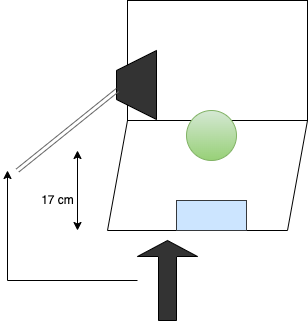  
   - Open the camera app on your mobile phone
   - Put the phone horizontally
   - Install the lamp above the phone at the 17 cm height
   - Focus (tap on the object on the screen)   
    > Important:
    > I use iPhone 13 pro, table lamp model: ALH-T-BK-HD416A with bulb VOLPE led 50, 
    >175-250V
4. Take a picture of the apple

5. Remove extra space in the photo editor (I used _Lightroom_)
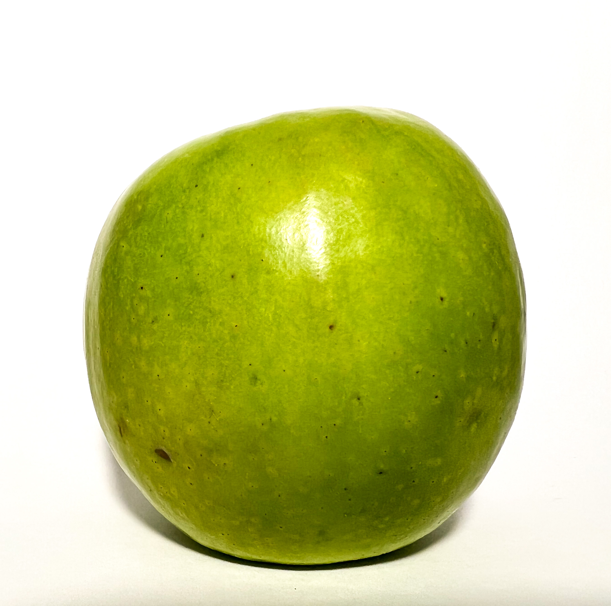
6. In the _Lightroom_ app, open **Light** -> **Whites** `+100`, **Blacks** `-13`
7. If you want to reduce the shade, choose a **pen tool**, choose the white colour and remove all shades
8. Final view:
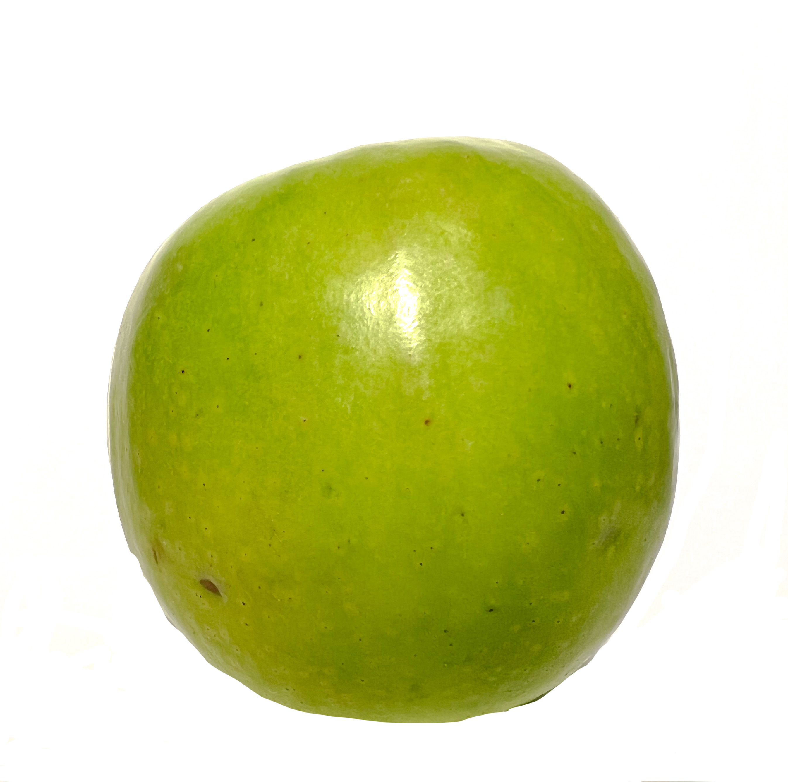

## _Optional step. Work with Photoshop_

I know, you want to get a high-quality picture and you are a pro, So here are some tips on how to make this picture look perfect:
1. Open the _Photoshop_ app on your computer and add the picture of the apple. Set **Brightness** to `+52` and **Contrast** to `+11`
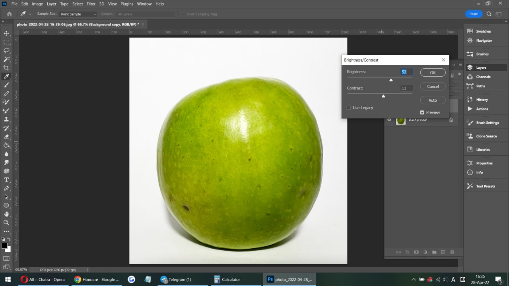
2. Choose the **Object selection** tool, select the area with the apple, then _Photoshop_ does the magic
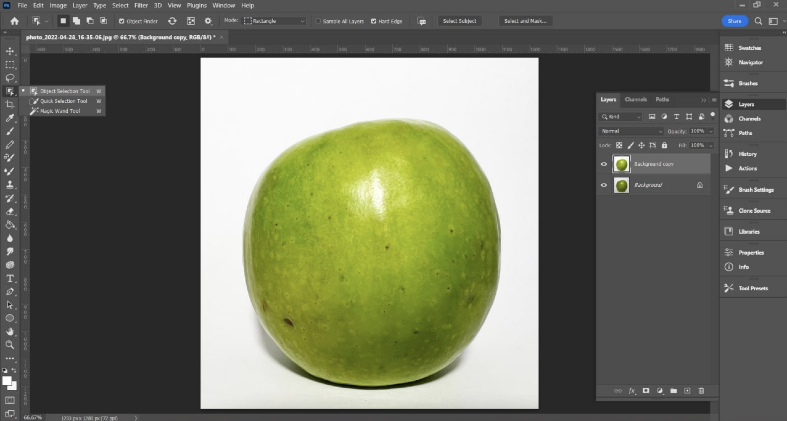
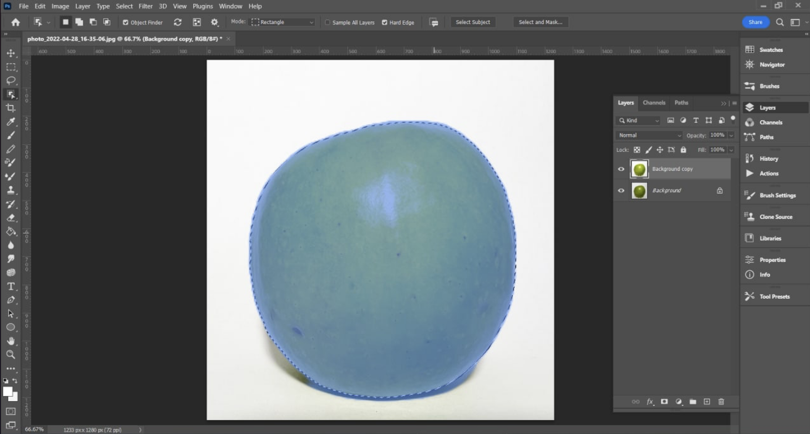
3. Choose **Layer**->**New**->**Layer** via **Cut**. Fill the background layer with white, then use an **eraser** or a **diagonal lasso** to remove irregularities. Additionally, you can go over the apple layer with the highlight tool to smooth out the tone.
4. Final view:
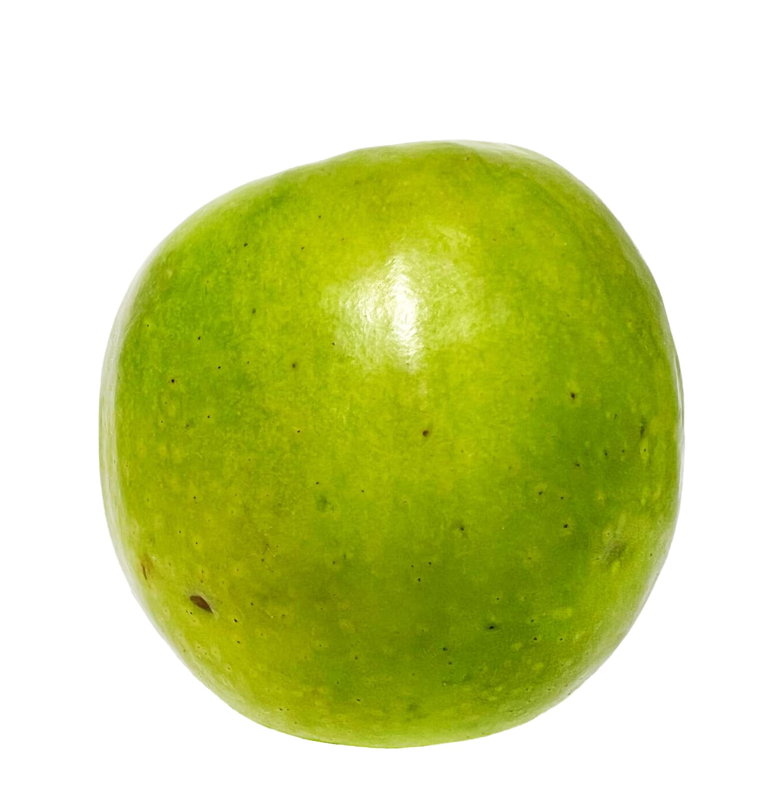

    > Everything will take you from 7 to 17 minutes. Try it.

## _Preparation 2_
This picture was taken on the balcony in the daylight. Not under direct sunlight.
1. Take three sheets of paper and place them in a way lit place
2. Put an apple in the middle of the sheet
  
    

    <a href="images/9.png">
    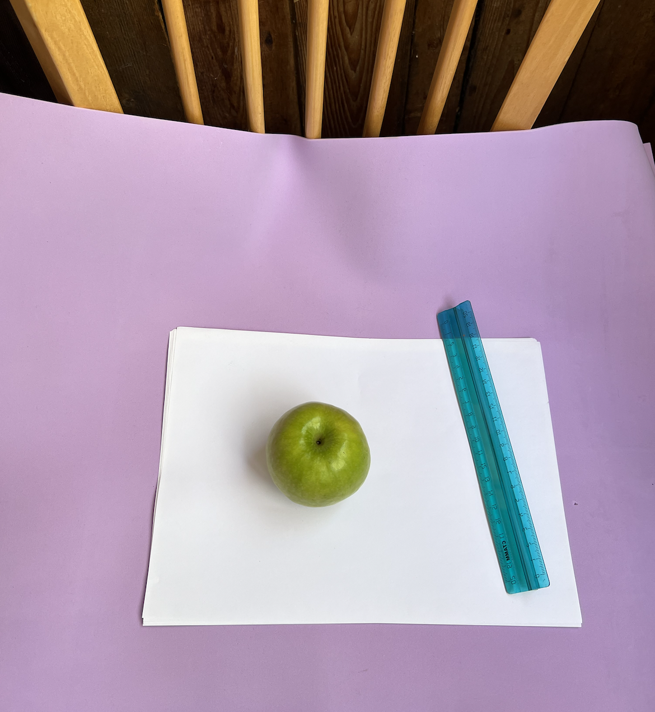
    </a>
    

3. Set the phone as shown on the scheme
      
    

    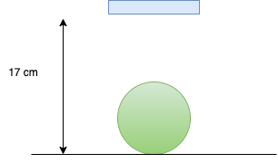
    

    
   - Open the camera app on your mobile phone
   - Put the phone above the object at the 17 cm height
   - Focus (tap on the object on the screen) 
4. Take a picture of the apple
    
    

    <a href="images/10.png">
    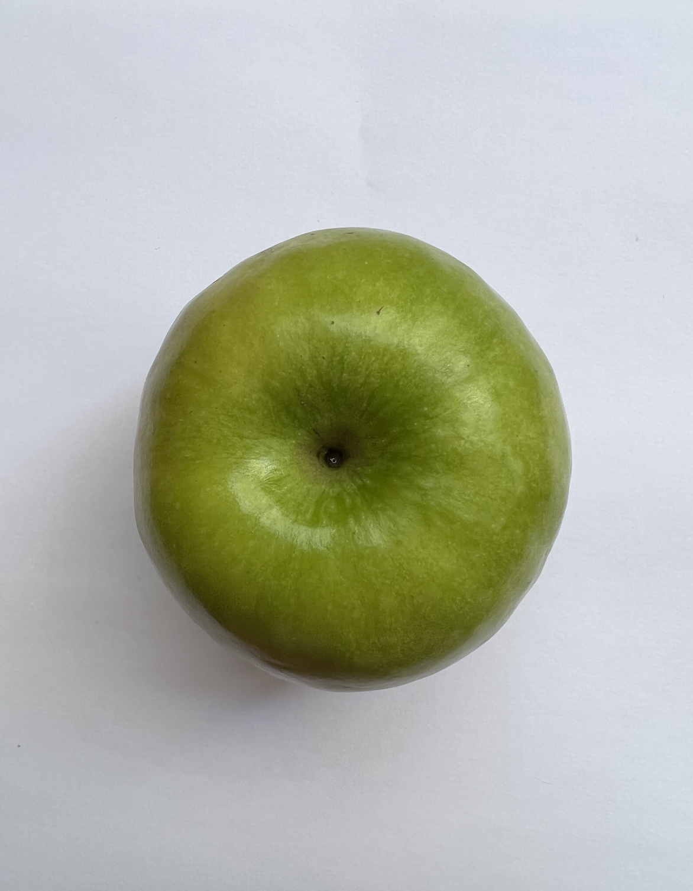
    </a>
    

5. Using the directions listed above, beautify this apple.

| Lightroom | Photoshop |
| --- | --- |
| [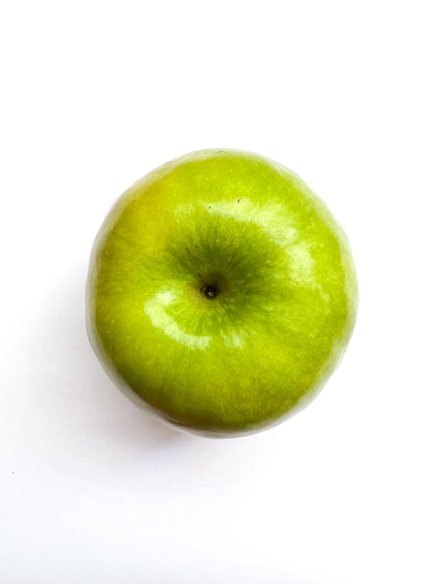](images/11-full-res.jpg) | 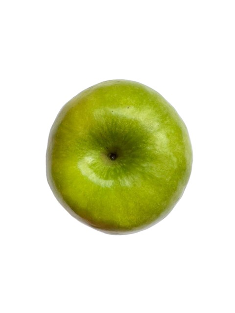 |
